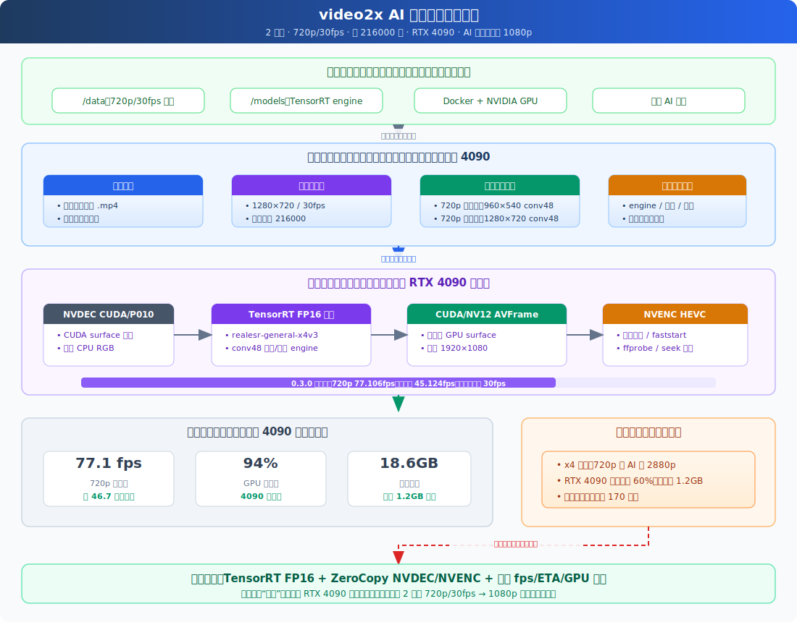

# 技术架构图



## 1. 目标场景

输入视频：

- 时长：2 小时
- 分辨率：720p
- 帧率：30fps
- 总帧数：约 `216000`

输出目标：

- 最终高度：1080p
- AI 超分倍率：`1080 / 720 = 1.5`
- 硬件：单张 RTX 4090
- 性能目标：接近或达到 `30fps` 处理吞吐，让 2 小时视频尽量在 2 小时内完成，甚至更短。

关键判断：

```text
216000 frames / 2 hours = 30 fps
```

所以本项目的速度目标不是抽象的“更快”，而是让整条链路尽量稳定接近或超过 `30fps`。

## 2. 4090 性能释放路径

核心变化：

- 不再走 `x4 -> 2880p` 的低效路线。
- 720p 直接按最终目标 `outscale=1.5` 输出 1080p。
- 处理时持续观察 fps、预计剩余时间、GPU 利用率和显存占用。
- 如果 GPU 利用率长期偏低，就把它当成架构缺陷处理，而不是接受结果。

## 3. 2 小时内完成的吞吐模型

估算公式：

```text
预计耗时 = 总帧数 / 实测 fps
```

示例：

```text
216000 / 30fps = 7200 秒 = 2 小时
216000 / 45fps = 4800 秒 = 1 小时 20 分
216000 / 60fps = 3600 秒 = 1 小时
```

## 4. 运行时观测

正式处理时必须持续输出类似日志：

```text
Progress:
  input: /data/movie.mp4
  input: 1280x720, 30fps, 216000 frames
  output: /data/movie_1080p.mp4
  model: RealESRGAN_x2plus
  outscale: 1.5
  frames: 64800 / 216000
  progress: 30.00%
  speed: 32.4 fps
  estimated remaining: 1h 09m
  gpu: 94%
  memory: 18.6GB / 24GB
```

这类日志给用户信心：

- 当前速度是否达到 30fps。
- 预计是否能在 2 小时内完成。
- 4090 是否真的忙起来了。
- 显存是否被合理使用。
- 如果速度不达标，能看到瓶颈排查方向。

## 5. 性能瓶颈处理

速度验收不是只看最终文件是否生成，而是看：

- 720p 是否直接到 1080p。
- 是否稳定输出实时 fps。
- 是否接近或超过 30fps。
- RTX 4090 是否保持高利用率。
- 如果没有达到，日志是否能指向瓶颈。

## 6. 架构信心来源

本项目能挑战 2 小时内完成的依据不是“4090 很强”这句话，而是以下架构约束：

- 砍掉旧路线中 `720p -> 2880p` 的无效 AI 计算。
- 默认使用 CUDA/PyTorch 路线，而不是 CPU 推理。
- 以最终 1080p 为目标计算 `outscale`，不做多余倍率。
- 启动前自动识别任务，避免错误处理已达标视频。
- 运行中强制暴露 fps、ETA、GPU 利用率和显存。
- 一旦 4090 没有被充分释放，就把解码、编码、IO、Python 调度纳入瓶颈排查。

换句话说，架构目标不是“能跑”，而是“让 4090 忙起来，并用日志证明它忙起来了”。
